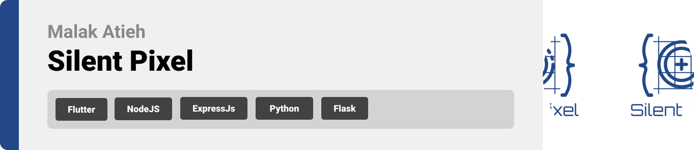

  

<!-- project overview -->

> System that allows users to hide and retrieve secret messages within images shared on popular social media platforms using steganography techniques. Users are also able to anaylze images for possible stego hidden content.

  

<!-- System Design -->

### Database Schema

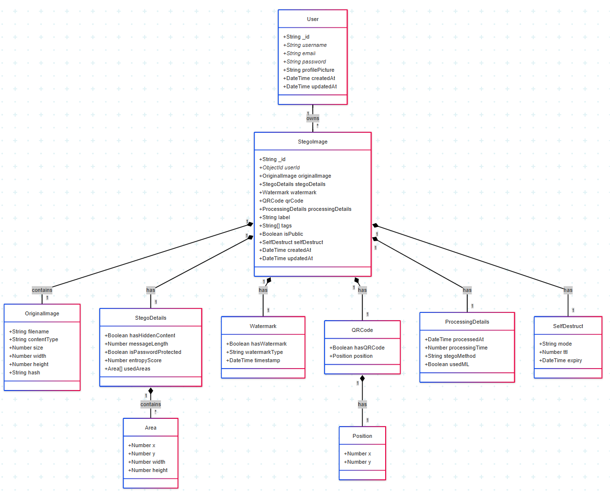

### Component Diagram

  

<!-- Project Highlights -->

### Make Pixels Talk

  

<!-- Demo -->

### User Screens (Mobile)

| Welcoming Onboarding screen             | Seconf onboarding screen              | 3rd onboarding screen                 |
| --------------------------------------- | ------------------------------------- | ------------------------------------- |
|        | 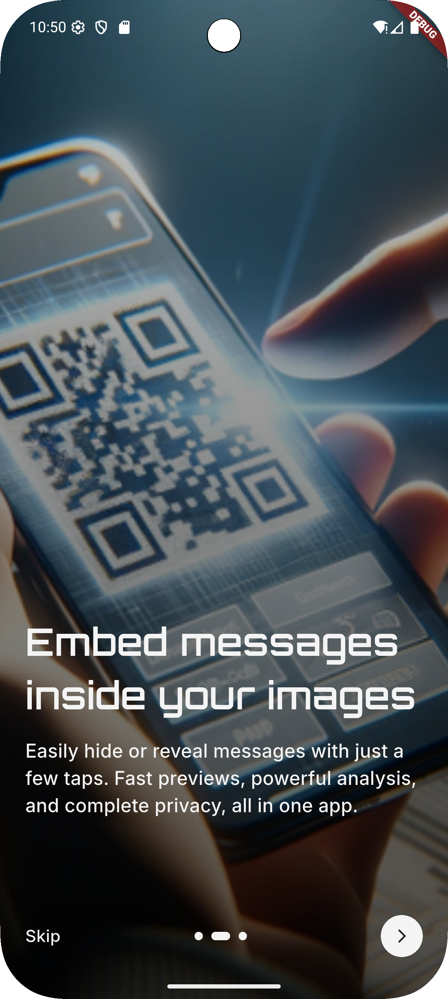       | 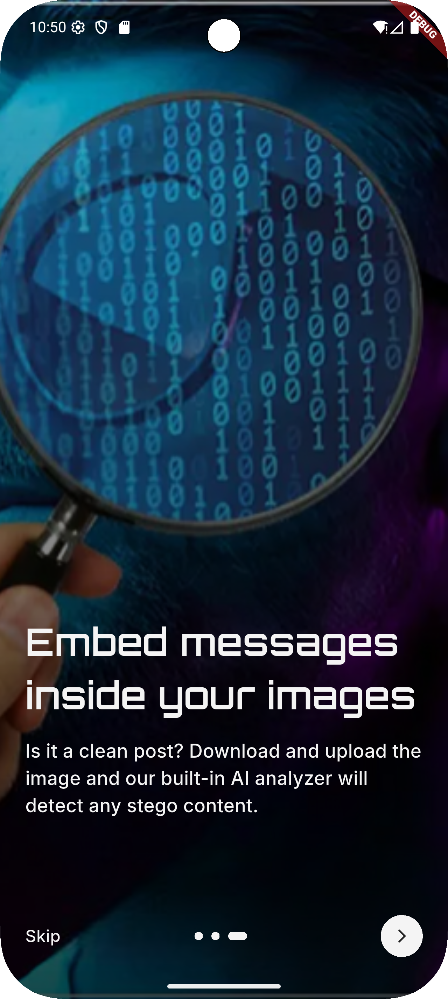       |

| Login screen                            | Register screen                       | Home screen                           |
| --------------------------------------- | ------------------------------------- | ------------------------------------- |
| 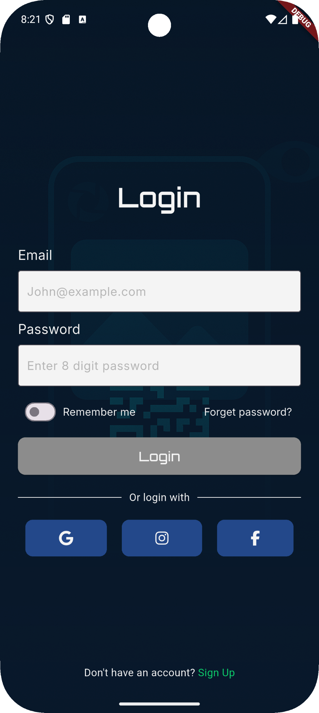          | 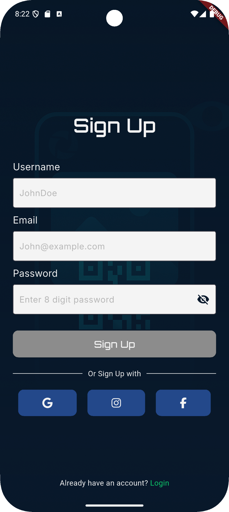         | 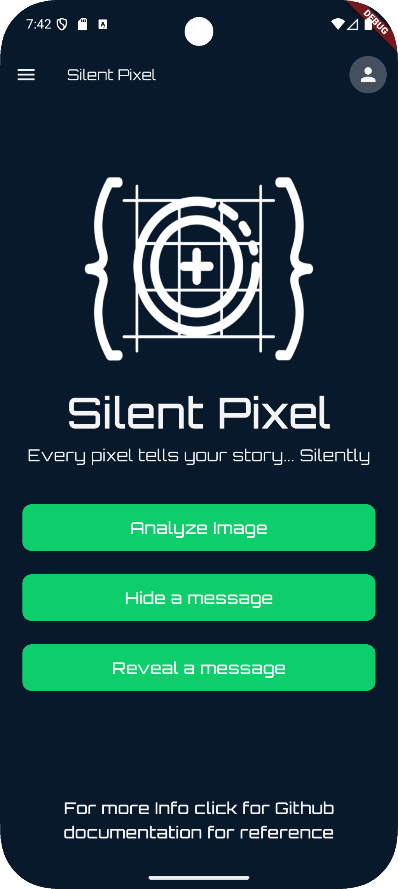           |

| Hide message screen                     | Hide Result screen                    | Reveal message screen                 |
| --------------------------------------- | ------------------------------------- | ------------------------------------- |
| 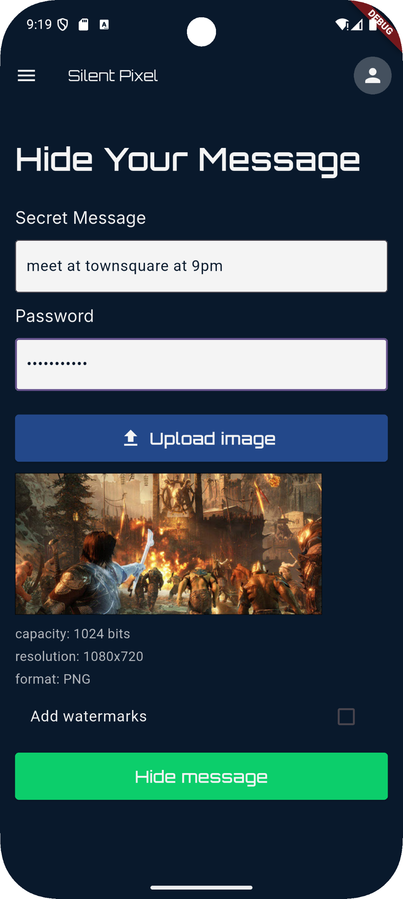    | 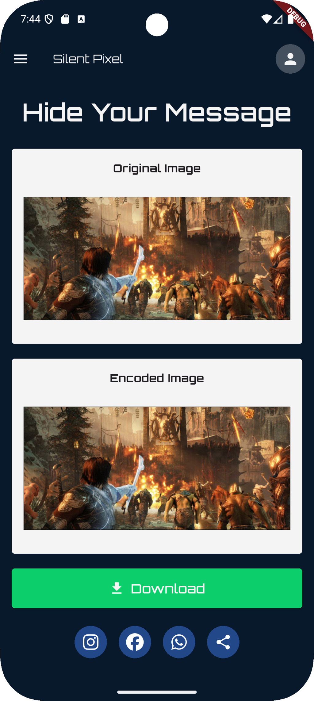   | 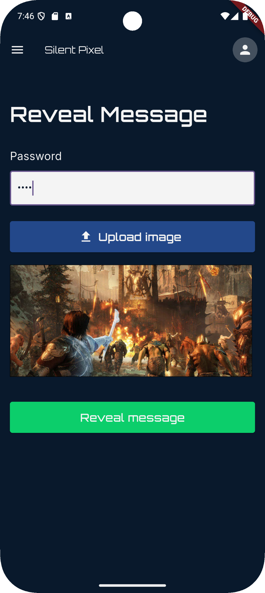          |

| Reveal Result screen                    | |
| --------------------------------------- | |
| 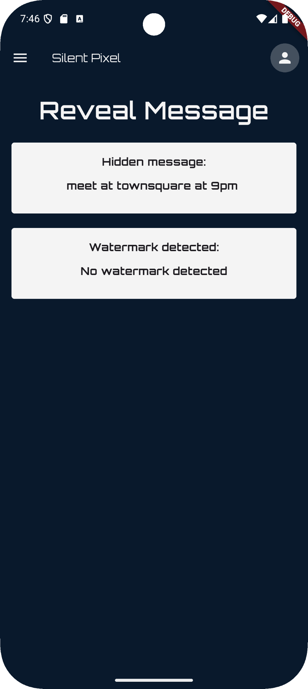   | |  

### Screens Gifs

|  Onboarding                             |  Auth Home                            |  Hide Message                         |
| --------------------------------------- | ------------------------------------- | ------------------------------------- |
|        |    |     |

| Reveal Message                         | 
| -------------------------------------  | 
|    | 

  

<!-- Development & Testing -->

### Silent Workflow

| Services                                | Validation                            | Testing                               |
| --------------------------------------- | ------------------------------------- | ------------------------------------- |
| 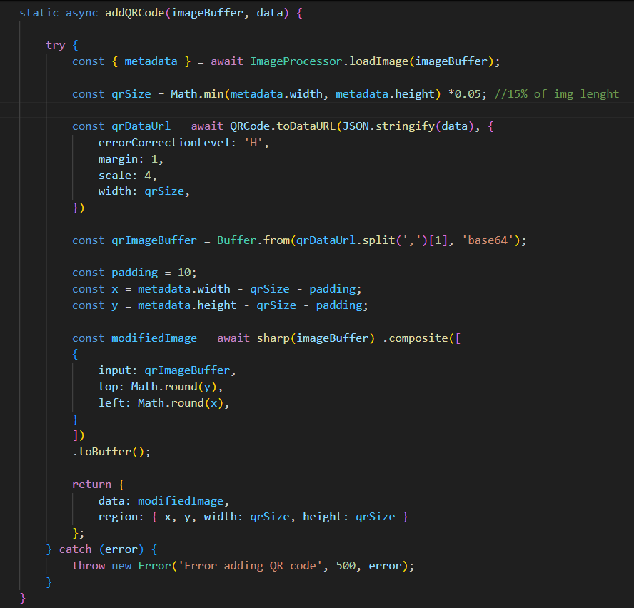          | 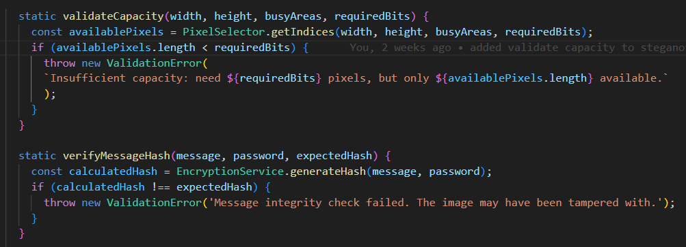     | 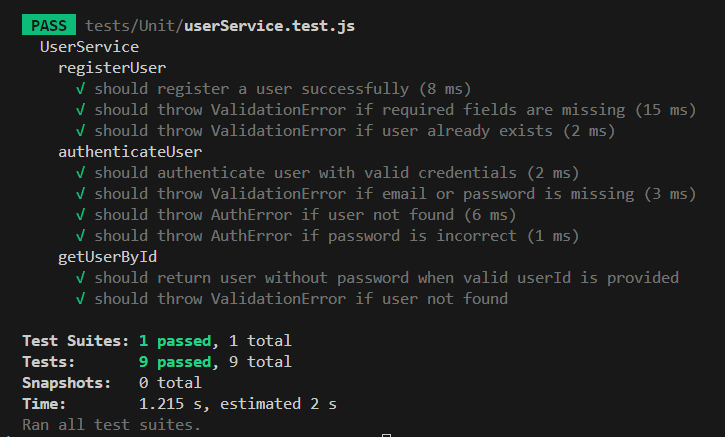 |

  

<!-- Deployment -->

### Deployment to AWS EC2

- Staging IP: 15.236.41.118
- Production IP: 13.38.82.220

| Postman API 1                           | Postman API 2                         | Postman API 3                        |
| --------------------------------------- | ------------------------------------- | ------------------------------------- |
| 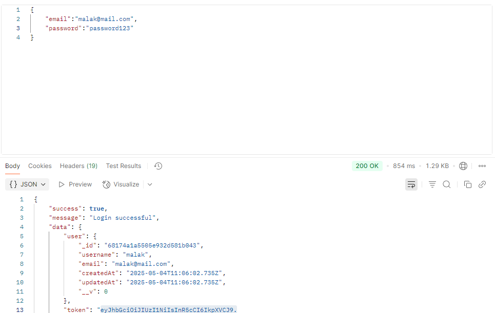   | 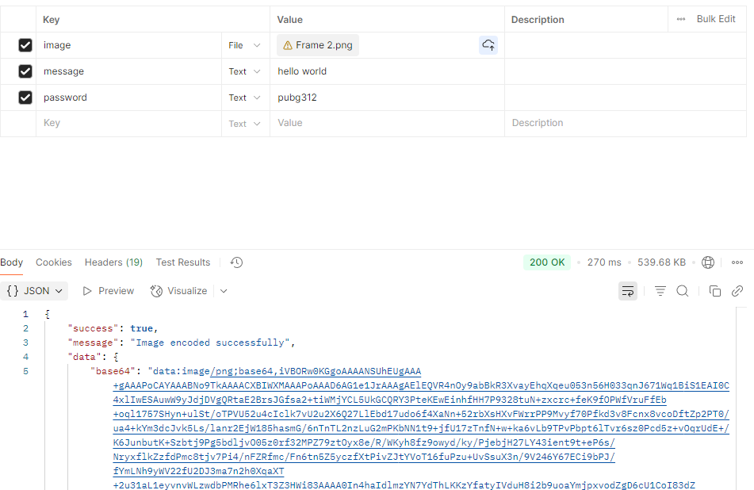  | 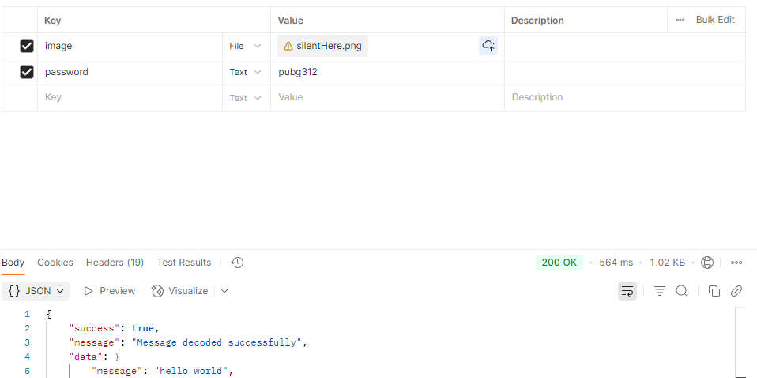 |

  
